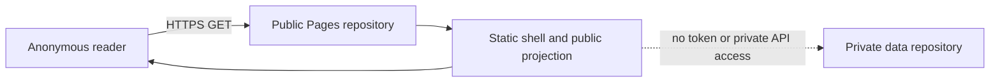
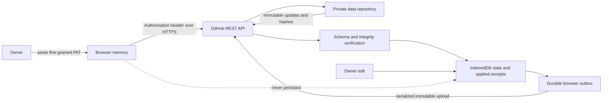
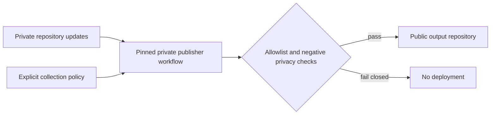

# ResearchPocket V2 privacy threat model

Status: security boundary for synchronization, hosted owner mode, and
publication

Last verified against GitHub and CSP documentation: 2026-07-11

## Scope and security goals

This document covers the local V2 client, a private GitHub data repository, the
GitHub API, the public GitHub Pages application shell, browser persistence, and a
separate public publication repository. It is a prerequisite for the sync
protocol, hosted owner editor, and publisher.

ResearchPocket protects:

- the complete private library, including URLs, titles, notes, tags, lifecycle
  history, and unpublished collection policy;
- the owner's GitHub credential and the authority it grants;
- pending offline edits that have not reached GitHub;
- the integrity and completeness of immutable synchronization updates; and
- the boundary between private state and explicitly published projections.

V2 trusts GitHub's private-repository access control. End-to-end encryption,
protection from a compromised owner device or browser profile, and secure erase
from existing Git history are outside the V2 guarantee.

## Decisions

| ID | Decision |
| --- | --- |
| TM-01 | Private synchronization data and public Pages output use different repositories. |
| TM-02 | The browser owner credential is a fine-grained PAT limited to the one private data repository with `Contents: read/write`, expiring after at most 90 days. |
| TM-03 | The owner PAT cannot write the repository that serves the application JavaScript or any public publication repository. |
| TM-04 | The browser keeps the PAT in JavaScript memory by default. Explicit tab-only retention may use `sessionStorage`; no longer-lived browser storage is allowed. |
| TM-05 | IndexedDB may contain private CRDT state and a durable outbox, but never a credential. |
| TM-06 | Owner mode loads no third-party runtime code, fonts, analytics, ads, error reporters, or tag managers. |
| TM-07 | Synchronization applies only validated immutable protocol objects. Git commits and branch order have no domain meaning. |
| TM-08 | Publication is a separate allowlisted projection. Missing, invalid, or concurrent visibility resolves to private. |
| TM-09 | A service worker may cache only the public application shell. It never caches GitHub API traffic, credentials, private state, or publication previews. |
| TM-10 | Deletion creates a tombstone. Historical erasure requires repository replacement or an explicit history rewrite. |

## Trust boundaries

| Component | Trust and permitted data |
| --- | --- |
| Native CLI/TUI/local UI | Trusted on the owner's device. May read private state. Native credentials use the OS credential store or an ignored `0600` file, never SQLite. |
| Public Pages repository | Public and attacker-readable. Contains only the static application shell and allowlisted public projections. It never contains private updates or credentials. |
| Pages application shell | Trusted only when built from reviewed, locked, first-party source. It may handle private state after owner authentication. |
| Browser memory | Temporarily trusted for the owner PAT and decrypted-in-use private state. Browser extensions, developer tools, and injected scripts can observe it. |
| `sessionStorage` | Optional, explicit tab-session PAT retention. It is convenience, not an XSS boundary, and is cleared on logout and authentication failure. |
| IndexedDB | Private materialized state, applied-update receipts, and pending immutable updates. Never credentials. |
| Private data repository | Complete immutable updates, checkpoints, and private policy. GitHub collaborators and repository administrators can read its history. |
| GitHub REST API | Trusted transport/authentication boundary. Every returned protocol object is still hash- and schema-verified locally. |
| Publisher workflow | Trusted, pinned workflow in the private repository. It reads private state and writes only an allowlisted projection using a separate credential. |
| Third-party pages and networks | Untrusted. They receive no owner data, analytics events, referrers containing secrets, or runtime requests from owner mode. |

## Repository and credential topology

The repositories have non-overlapping responsibilities:

1. **Private data repository:** immutable update batches, checkpoints, and
   private publication policy. The owner PAT selects only this repository and
   grants only `Contents: read/write` (write includes read).
2. **Application/publication repository:** reviewed static application assets
   and sanitized public output. The browser owner PAT has no access to it.

The hosted editor never needs `Administration`, `Actions`, `Pages`, `Workflows`,
`Issues`, `Pull requests`, or organization permissions. Repository creation and
Pages configuration are separate setup operations performed outside owner mode.

ResearchPocket's maximum token lifetime is 90 days even when GitHub permits a
longer or unlimited expiration. Organization policy may impose a shorter limit
or require administrator approval. Setup validates repository identity and
write access before accepting a token; it does not broaden permissions to make a
failed validation pass.

The publisher does not reuse the owner PAT. A separate fine-grained credential
or GitHub App installation is limited to writing the public output repository.
It cannot read the private data repository except through the private workflow's
checked-out input. GitHub Contents permission is repository-wide rather than
path-scoped, so this credential can technically overwrite shell files in the
public repository. The pinned publisher must allowlist output paths, serialize
writes, and keep this credential only in the private workflow; compromise of that
credential remains a first-party code-injection risk.

## Browser credential lifecycle

1. The owner pastes the PAT into a password input on the Pages origin.
2. The application stores it in a closure/module-private memory object, not in
   reactive state inspection tools, DOM attributes, URLs, or logs.
3. The application validates the selected owner/repository and required
   Contents access through the GitHub API.
4. By default, reload discards the PAT. If the owner explicitly enables
   **Remember for this tab**, the token may be placed in `sessionStorage` under
   one versioned key.
5. Logout, `401`, confirmed revocation/expiration, repository mismatch, or an
   integrity failure removes the in-memory and tab-session token immediately.
   Pending edits remain in IndexedDB for later retry.

The PAT must never enter:

- `localStorage`, IndexedDB, the Cache API, service-worker state, or filesystem
  downloads;
- query strings, URL fragments, navigation state, referrers, bookmarks, or QR
  codes;
- console logs, analytics, crash reports, telemetry, DOM text/attributes, or
  source maps;
- protocol envelopes, SQLite, exports, checkpoints, publication artifacts, or
  Git commit messages; or
- the clipboard except for the owner's original copy/paste action.

## Data flows

### Anonymous reader



Anonymous mode does not contact the private repository or expose an owner login
state to analytics. Public JSON and feeds come from the same allowlisted
projection as the rendered page.

### Authenticated owner



An edit is durable in IndexedDB before network activity. Pull and push failures,
token expiry, reload, or a branch-head race leave the outbox intact. GitHub
responses decide only transport success; Loro updates decide application state.

### Publisher



## Content security and dependency policy

Owner mode uses a self-only CSP equivalent to:

```text
default-src 'none';
script-src 'self';
style-src 'self';
img-src 'self' data:;
font-src 'self';
connect-src https://api.github.com;
worker-src 'self';
frame-src 'none';
object-src 'none';
base-uri 'none';
form-action 'none';
manifest-src 'self';
upgrade-insecure-requests
```

No inline/evaluated script, remote module, CDN asset, third-party font, or
runtime package download is permitted. Dependencies are locked, bundled, and
reviewed in the application repository. Production builds omit public source
maps and disable console logging.

When the host cannot set a CSP response header, a CSP `meta` element must be the
first applicable element in `<head>`. This is weaker: CSP Level 3 specifies that
`frame-ancestors`, reporting, and `sandbox` do not work from a `meta` policy.
Consequently clickjacking protection is a documented residual risk on standard
Pages hosting; a custom fronting host that can set response headers is required
for `frame-ancestors 'none'`.

The service worker caches only versioned, same-origin public shell assets. Its
fetch handler bypasses every cross-origin request and every request carrying an
`Authorization` header. It does not cache API responses, private projections,
owner HTML variants, publication previews, POST/PUT requests, or error bodies.
Activating a new shell version removes old caches.

## Logging, caching, and browser persistence

- Owner mode has no analytics or telemetry endpoint.
- Production logs never include tokens, authorization headers, URLs, titles,
  notes, tags, repository contents, request bodies, or GitHub response bodies.
- GitHub API fetches use `cache: "no-store"`; the service worker does not
  intercept them.
- IndexedDB schema is versioned and stores only protocol state, materialized
  private data, receipts, and pending updates.
- A browser profile backup may retain IndexedDB private data. Logout removes the
  credential but does not silently destroy the offline library or queued edits.
- Browser extensions and a compromised profile can read in-use private data and
  memory credentials; V2 cannot defend against that device-level compromise.

## Threats and mitigations

| Threat | Required mitigation | Residual risk |
| --- | --- | --- |
| XSS steals the PAT | Self-only CSP, no inline/eval, no third-party runtime, locked dependencies, escaped rendering, no raw authored HTML | A compromised first-party build or browser extension can still read memory. |
| PAT is over-scoped | Fine-grained token, one selected private repository, Contents read/write only, 90-day maximum, validation before use | Repository administrators and GitHub retain their normal authority. |
| Malicious Pages update captures credentials | Owner PAT cannot write the application repository; protected review/deployment process; pinned build inputs | A compromised maintainer or hosting account can publish malicious first-party code. |
| Private data leaks through publication | Separate repositories; explicit collection and field allowlists; notes off by default; unresolved visibility private; negative artifact scans | Previously published Git history remains until rewritten. |
| Service worker retains a token or API response | Never pass tokens to the worker; bypass Authorization/cross-origin traffic; cache shell allowlist only | Browser implementation defects remain possible. |
| Git race loses or overwrites an edit | Immutable unique paths, pull-before-push, serialized upload, hash equality for idempotency, retry unchanged outbox | GitHub outage delays sync but does not discard local edits. |
| Corrupt/replayed remote update changes state | Envelope schema/version checks, library identity, payload SHA-256, immutable device sequence/path, applied receipt | A repository writer can delete history; clients must detect missing/inconsistent data. |
| Token appears in logs or URLs | Authorization header only; redacted errors; no analytics; no token interpolation; production console off | User-installed debugging tools may capture traffic. |
| Clickjacking tricks PAT entry | Header CSP with `frame-ancestors 'none'` where supported; document weaker Pages meta-CSP boundary | Standard Pages meta CSP cannot enforce `frame-ancestors`. |
| Delete is mistaken for secure erase | UI calls it delete/tombstone and documents history retention; provide repository replacement procedure | GitHub and local backups may retain earlier bytes. |

## Publication fail-closed rules

An item or field is private unless an explicit, valid collection policy selects
it. Notes are excluded unless the policy separately enables them. Tombstones,
operation history, causal revisions, import provenance, credentials, and
unselected fields are never publication inputs. Concurrent or malformed
visibility is private until a later explicit owner action observes and resolves
it.

The publisher uses one pure projection path for preview and deployment. Any
unexpected field, secret pattern, private item, source map, or non-allowlisted
artifact aborts the entire deployment; it does not publish a partial result.

## Retention, revocation, and incident response

CRDT deletion does not erase Git history, checkpoints, local backups, browser
backups, or previously published commits. Secure erasure requires revoking
credentials, creating a new private data repository (or deliberately rewriting
all history), migrating only retained current state, updating every client, and
deleting the old repository subject to GitHub's retention behavior.

If credential exposure or a malicious build is suspected:

1. revoke the PAT in GitHub immediately;
2. close owner tabs and clear the site's `sessionStorage`, service workers, and
   caches without deleting IndexedDB pending edits;
3. disable the Pages deployment or replace it with a known-good shell;
4. audit repository collaborators, token access, immutable update paths, and
   publication history;
5. rotate the separate publisher credential; and
6. reconnect clients only after integrity verification and a reviewed rebuild.

## Required verification for dependent work

Hosted-editor and sync changes must demonstrate:

- token absence from localStorage, IndexedDB, Cache API, service-worker messages,
  URLs, logs, source maps, and generated artifacts;
- a token scoped only to the private data repository with Contents read/write;
- offline/reload survival of queued edits with an expired or revoked token;
- CSP and network inspection showing only same-origin assets and
  `https://api.github.com` owner traffic;
- negative publication scans for private fields and synchronization state; and
- lossless handling of duplicate upload, timeout, rate limit, and branch-head
  races without Git merge or user conflict resolution.

## References

- [GitHub: managing fine-grained personal access tokens](https://docs.github.com/en/authentication/keeping-your-account-and-data-secure/managing-your-personal-access-tokens)
- [GitHub: permissions required for fine-grained tokens](https://docs.github.com/en/rest/authentication/permissions-required-for-fine-grained-personal-access-tokens)
- [GitHub: repository Contents API](https://docs.github.com/en/rest/repos/contents)
- [W3C Content Security Policy Level 3](https://www.w3.org/TR/CSP3/)

Any change to TM-01 through TM-10 requires an explicit security review and
updates to dependent protocol, hosted-editor, and publisher documentation.
