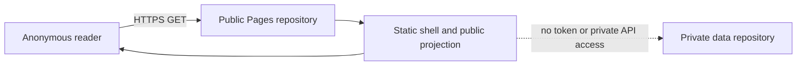
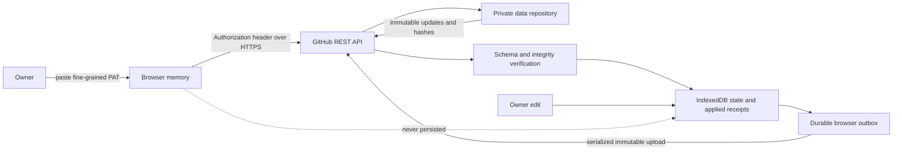
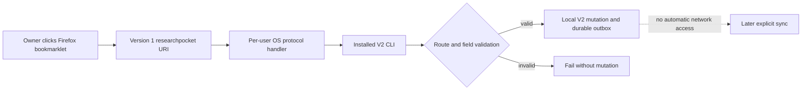
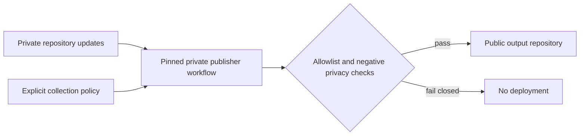

# ResearchPocket V2 privacy threat model

Status: security boundary for native browser capture, synchronization, hosted
owner mode, and publication. The immutable paths, envelopes, retries, receipts,
and version negotiation are specified by the
[synchronization protocol](./SYNC_PROTOCOL.md).

Last verified against GitHub, platform, and CSP documentation: 2026-07-13

## Scope and security goals

This document covers the local V2 client, the Firefox bookmarklet and native
protocol bridge, a private GitHub data repository, the GitHub API, the public
GitHub Pages application shell, browser persistence, and a separate public
publication repository. It is a prerequisite for native capture, the sync
protocol, hosted owner editor, and publisher.

ResearchPocket protects:

- the complete private library, including URLs, titles, notes, tags, lifecycle
  history, and unpublished collection policy;
- the owner's GitHub credential and the authority it grants;
- pending offline edits that have not reached GitHub;
- the integrity and completeness of immutable synchronization updates; and
- the boundary between private state and explicitly published projections.

V2 trusts GitHub's private-repository access control. End-to-end encryption,
protection from a compromised owner device or browser profile, and secure erase
from existing Git history are outside the V2 guarantee.

## Decisions

| ID | Decision |
| --- | --- |
| TM-01 | Private synchronization data and the public source/Pages repository are separate. |
| TM-02 | The browser owner credential is a fine-grained PAT limited to the one private data repository with `Contents: read/write`, expiring after at most 90 days. |
| TM-03 | The owner PAT cannot write the protected source repository that serves the application JavaScript or any public publication repository. |
| TM-04 | The browser keeps the PAT in JavaScript memory by default. Explicit tab-only retention may use `sessionStorage`; no longer-lived browser storage is allowed. |
| TM-05 | IndexedDB may contain private CRDT state and a durable outbox, but never a credential. |
| TM-06 | Owner mode loads no third-party runtime code, remote fonts, analytics, ads, error reporters, or tag managers. Reviewed webfonts may be bundled in the same-origin application artifact. |
| TM-07 | Synchronization applies only validated immutable protocol objects. Git commits and branch order have no domain meaning. |
| TM-08 | Publication is a separate allowlisted projection. Missing, invalid, or concurrent visibility resolves to private. |
| TM-09 | A service worker may cache only the public application shell. It never caches GitHub API traffic, credentials, private state, or publication previews. |
| TM-10 | Deletion creates a tombstone. Historical erasure requires repository replacement or an explicit history rewrite. |
| TM-11 | Native bookmarklet capture uses a per-user `researchpocket://capture` handler with a versioned, append-only field allowlist. The URI never selects a filesystem path, carries a credential, executes a command, or starts synchronization. |
| TM-12 | The owner application has exclusive use of the `https://researchpocket.github.io` origin. The former `/ResearchPocket/` paths may contain only compatibility redirects built from the same protected source; no unrelated active Pages project may share the origin. |

## Trust boundaries

| Component | Trust and permitted data |
| --- | --- |
| Native CLI/TUI/local UI | Trusted on the owner's device. May read private state. CLI synchronization reads a PAT only from the process environment; it does not persist the credential. |
| Public source and Pages repository | Public and attacker-readable. Its protected source builds the static application shell and allowlisted public projections. It never contains private updates or owner credentials. |
| Pages application shell | Trusted only when built from reviewed, locked, first-party source. It may handle private state after owner authentication. |
| Browser memory | Temporarily trusted for the owner PAT and decrypted-in-use private state. Browser extensions, developer tools, and injected scripts can observe it. |
| `sessionStorage` | Optional, explicit tab-session PAT retention. It is convenience, not an XSS boundary, and is cleared on logout and authentication failure. |
| IndexedDB | Private materialized state, applied-update receipts, and pending immutable updates. Never credentials. |
| Private data repository | Complete immutable updates, checkpoints, and private policy. GitHub collaborators and repository administrators can read its history. |
| GitHub REST API | Trusted transport/authentication boundary. Every returned protocol object is still hash- and schema-verified locally. |
| Publisher workflow | Trusted, pinned workflow in the private repository. It reads private state and writes only an allowlisted projection using a separate credential. |
| Firefox bookmarklet | User-triggered but runs in the current page's untrusted browser context. The standard bookmarklet may send only the current page URL and title in a versioned capture URI. |
| OS protocol dispatcher | Trusted only to deliver one URI to the installed per-user handler. Browser and operating-system history, diagnostics, or other same-user processes may observe that payload. |
| Third-party pages and networks | Untrusted. They receive no owner data, analytics events, referrers containing secrets, or runtime requests from owner mode. |

The implemented browser-store, static-shell, and private synchronization
behavior is documented in [WEB.md](./WEB.md). The credential lifecycle below is
the binding contract for that owner surface.

GitHub Pages project paths are not storage boundaries. Every project served
below `https://researchpocket.github.io/` shares the same web origin, so
`localStorage`, `sessionStorage`, IndexedDB, the Cache API, and same-origin
script authority are origin-wide even when URLs have different project paths.
ResearchPocket's organization Pages origin must therefore host no unrelated
active Pages projects while it hosts the owner application. The same-build
compatibility redirects under `/ResearchPocket/` are permitted only for the URL
migration and execute only the reviewed redirect/cleanup script, never the owner
application. Any additional project must use a separate origin or custom domain
and receive a new security review.

## Repository and credential topology

The repositories have non-overlapping responsibilities:

1. **Private data repository:** immutable update batches, checkpoints, and
   private publication policy. The owner PAT selects only this repository and
   grants only `Contents: read/write` (write includes read).
2. **Application/publication repository:** reviewed static application assets
   and sanitized public output. The browser owner PAT has no access to it.

The hosted editor never needs `Administration`, `Actions`, `Pages`, `Workflows`,
`Issues`, `Pull requests`, or organization permissions. Repository creation and
Pages configuration are separate setup operations performed outside owner mode.

ResearchPocket's maximum token lifetime is 90 days even when GitHub permits a
longer or unlimited expiration. Organization policy may impose a shorter limit
or require administrator approval. Setup validates repository identity and
write access before accepting a token; it does not broaden permissions to make a
failed validation pass.

The publisher does not reuse the owner PAT. A separate fine-grained credential
or GitHub App installation is limited to writing the public output repository.
It cannot read the private data repository except through the private workflow's
checked-out input. GitHub Contents permission is repository-wide rather than
path-scoped, so this credential can technically overwrite shell files in the
public repository. The pinned publisher must allowlist output paths, serialize
writes, and keep this credential only in the private workflow; compromise of that
credential remains a first-party code-injection risk.

### Application deployment controls

Repository separation limits the owner PAT's authority, but it does not make a
deployed application shell trustworthy by itself. Before the hosted owner app
accepts credentials, operators must configure and verify all of these controls:

- protect `main` against direct and force pushes, require reviewed pull requests,
  and require the build, CSP, dependency, credential, and artifact checks;
- protect `v*` release tags against updates and deletion, limit repository write
  access to release maintainers, and require the release workflow to reject any
  tag whose commit is not already on protected `main`; and
- permit Pages and release deployment only from the reviewed, pinned workflow
  and its verified build artifact.

These are required operational controls configured in GitHub, not guarantees
created automatically by a repository boundary or by this document. If they are
absent or cannot be verified, the hosted shell must not be used for PAT entry.

## Native credential lifecycle

Native synchronization reads `RESEARCHPOCKET_GITHUB_TOKEN`, with `GH_TOKEN` as
a fallback, from the current process environment only. V2 does not integrate an
OS credential store and does not write a token to an ignored file, SQLite, or
any other persistent storage. Owners should populate the variable with a silent
shell prompt immediately before synchronization and unset it afterward. The TUI
and native capture handler neither read this credential nor start a sync.

## Browser credential lifecycle

1. The owner pastes the PAT into a password input on the Pages origin.
2. The application stores it in a closure/module-private memory object, not in
   reactive state inspection tools, DOM attributes, URLs, or logs.
3. The application validates the selected owner/repository and required
   Contents access through the GitHub API.
4. By default, reload discards the PAT. If the owner explicitly enables
   **Remember for this tab**, the token may be placed in `sessionStorage` under
   one versioned key.
5. Logout, `401`, confirmed revocation/expiration, repository mismatch, or an
   integrity failure removes the in-memory and tab-session token immediately.
   Pending edits remain in IndexedDB for later retry.

The PAT must never enter:

- `localStorage`, IndexedDB, the Cache API, service-worker state, or filesystem
  downloads;
- query strings, URL fragments, navigation state, referrers, bookmarks, or QR
  codes;
- console logs, analytics, crash reports, telemetry, DOM text/attributes, or
  source maps;
- protocol envelopes, SQLite, exports, checkpoints, publication artifacts, or
  Git commit messages; or
- the clipboard except for the owner's original copy/paste action.

## Data flows

### Anonymous reader



Anonymous mode does not contact the private repository or expose an owner login
state to analytics. Public JSON and feeds come from the same allowlisted
projection as the rendered page.

### Authenticated owner



An edit is durable in IndexedDB before network activity. Pull and push failures,
token expiry, reload, or a branch-head race leave the outbox intact. GitHub
responses decide only transport success; Loro updates decide application state.

### Native bookmarklet capture



The standard bookmarklet transports only the current HTTP(S) page URL and title.
The OS registration binds an executable and one resolved local V2 data directory;
the URI cannot choose either. The internal handler accepts only the exact
`researchpocket://capture` route, protocol version 1, an absolute HTTP(S) target,
and bounded authored capture fields. Singleton fields cannot repeat; `tag` is the
only repeatable field. Unknown or malformed input fails before opening a mutation.

The OS passes one encoded URI to the handler as an argument; the handler decodes
its values as structured data, never as a shell command. It calls the same atomic
V2 create operation as `research add` and does not fetch metadata, read
credentials, contact GitHub, or start sync. A best-effort desktop notification
happens after commit, so notification failure cannot discard or duplicate the
durable capture.

Custom protocol schemes do not authenticate their caller. Firefox normally asks
before handing an external link to an application, but a permission remembered
for an untrusted site can allow that site to trigger further requests. The V2
handler is therefore deliberately append-only: an attacker can at worst create
bounded unwanted saves. It cannot query, edit, delete, publish, select another
library, execute a command, or gain synchronization authority.

### Publisher



## Content security and dependency policy

Owner mode uses a self-only CSP equivalent to:

```text
default-src 'none';
script-src 'self';
style-src 'self';
img-src 'self' data:;
font-src 'self';
connect-src https://api.github.com;
worker-src 'self';
frame-src 'none';
object-src 'none';
base-uri 'none';
form-action 'none';
manifest-src 'self';
upgrade-insecure-requests
```

No inline/evaluated script, remote module, CDN asset, remotely hosted font, or
runtime package download is permitted. Dependencies and licensed webfont assets
are locked, bundled, and reviewed in the application repository. Production
builds omit public source maps and disable console logging.

When the host cannot set a CSP response header, a CSP `meta` element must be the
first applicable element in `<head>`. This is weaker: CSP Level 3 specifies that
`frame-ancestors`, reporting, and `sandbox` do not work from a `meta` policy.
Consequently clickjacking protection is a documented residual risk on standard
Pages hosting; a custom fronting host that can set response headers is required
for `frame-ancestors 'none'`.

The service worker caches only versioned, same-origin public shell assets. Its
fetch handler bypasses every cross-origin request and every request carrying an
`Authorization` header. It does not cache API responses, private projections,
owner HTML variants, publication previews, POST/PUT requests, or error bodies.
Activating a new shell version removes old caches.

## Logging, caching, and browser persistence

- Owner mode has no analytics or telemetry endpoint.
- Production logs never include tokens, authorization headers, URLs, titles,
  notes, tags, repository contents, request bodies, or GitHub response bodies.
- GitHub API fetches use `cache: "no-store"`; the service worker does not
  intercept them.
- IndexedDB schema is versioned and stores only protocol state, materialized
  private data, receipts, and pending updates.
- A browser profile backup may retain IndexedDB private data. Logout removes the
  credential but does not silently destroy the offline library or queued edits.
- Browser extensions and a compromised profile can read in-use private data and
  memory credentials; V2 cannot defend against that device-level compromise.
- Capture URI payloads are not logged by ResearchPocket, but the current page URL,
  title, and any advanced authored fields pass through Firefox, OS protocol
  dispatch, and process arguments. The bookmarklet therefore includes no note,
  tags, path, repository identity, or credential by default.

## Threats and mitigations

| Threat | Required mitigation | Residual risk |
| --- | --- | --- |
| XSS steals the PAT | Self-only CSP, no inline/eval, no third-party runtime, locked dependencies, escaped rendering, no raw authored HTML | A compromised first-party build or browser extension can still read memory. |
| PAT is over-scoped | Fine-grained token, one selected private repository, Contents read/write only, 90-day maximum, validation before use | Repository administrators and GitHub retain their normal authority. |
| Malicious Pages update captures credentials | Owner PAT cannot write the application repository; keep source, Pages workflow, releases, and protected `main` and `v*` tags in the same reviewed repository with required checks and pinned deployment inputs | A compromised maintainer or hosting account can publish malicious first-party code. |
| Private data leaks through publication | Separate repositories; explicit collection and field allowlists; notes off by default; unresolved visibility private; negative artifact scans | Previously published Git history remains until rewritten. |
| Service worker retains a token or API response | Never pass tokens to the worker; bypass Authorization/cross-origin traffic; cache shell allowlist only | Browser implementation defects remain possible. |
| Git race loses or overwrites an edit | Immutable unique paths, pull-before-push, serialized upload, hash equality for idempotency, retry unchanged outbox | GitHub outage delays sync but does not discard local edits. |
| Corrupt/replayed remote update changes state | Envelope schema/version checks, library identity, payload SHA-256, immutable device sequence/path, applied receipt | A repository writer can delete history; clients must detect missing/inconsistent data. |
| Token appears in logs or URLs | Authorization header only; redacted errors; no analytics; no token interpolation; production console off | User-installed debugging tools may capture traffic. |
| Untrusted page invokes native capture | Browser external-protocol confirmation; exact route/version; bounded append-only field allowlist; no read, edit, delete, sync, or publication action | Remembered site permission can permit unwanted save spam. |
| Capture URI injects a command or selects private state | Direct argument handling without shell evaluation; reject unknown fields, paths, credentials, provider names, user information, fragments, and non-HTTP(S) targets | Browser, OS diagnostics, or same-user processes may observe the accepted URL and title. |
| Capture writes to the wrong library | Installer binds one resolved absolute data directory; status displays the binding; URI cannot override it | Moving the executable or changing libraries requires reinstalling the association. |
| Clickjacking tricks PAT entry | Header CSP with `frame-ancestors 'none'` where supported; document weaker Pages meta-CSP boundary | Standard Pages meta CSP cannot enforce `frame-ancestors`. |
| Delete is mistaken for secure erase | UI calls it delete/tombstone and documents history retention; provide repository replacement procedure | GitHub and local backups may retain earlier bytes. |

## Publication fail-closed rules

An item or field is private unless an explicit, valid collection policy selects
it. Notes are excluded unless the policy separately enables them. Tombstones,
operation history, causal revisions, import provenance, credentials, and
unselected fields are never publication inputs. Concurrent or malformed
visibility is private until a later explicit owner action observes and resolves
it.

The publisher uses one pure projection path for preview and deployment. Any
unexpected field, secret pattern, private item, source map, or non-allowlisted
artifact aborts the entire deployment; it does not publish a partial result.

## Retention, revocation, and incident response

CRDT deletion does not erase Git history, checkpoints, local backups, browser
backups, or previously published commits. Secure erasure requires revoking
credentials, creating a new private data repository (or deliberately rewriting
all history), migrating only retained current state, updating every client, and
deleting the old repository subject to GitHub's retention behavior.

If credential exposure or a malicious build is suspected:

1. revoke the PAT in GitHub immediately;
2. close owner tabs and clear the site's `sessionStorage`, service workers, and
   caches without deleting IndexedDB pending edits;
3. disable the Pages deployment or replace it with a known-good shell;
4. audit repository collaborators, token access, immutable update paths, and
   publication history;
5. rotate the separate publisher credential; and
6. reconnect clients only after integrity verification and a reviewed rebuild.

## Required verification for dependent work

Native-capture, hosted-editor, and sync changes must demonstrate:

- strict capture route, version, scheme, field, duplicate, size, and HTTP(S)
  target validation before mutation;
- one accepted capture produces exactly one normal durable outbox update, while
  rejected input produces none;
- capture registration is per-user and repeatable, binds one data directory, and
  treats notification as best-effort after commit;
- token absence from localStorage, IndexedDB, Cache API, service-worker messages,
  URLs, logs, source maps, and generated artifacts;
- a token scoped only to the private data repository with Contents read/write;
- repository rules and deployment configuration confirming protected `main`,
  immutable `v*` tags, reviewed changes, and required release checks;
- organization Pages configuration confirming that no other active project
  shares `https://researchpocket.github.io`;
- offline/reload survival of queued edits with an expired or revoked token;
- CSP and network inspection showing only same-origin assets and
  `https://api.github.com` owner traffic;
- negative publication scans for private fields and synchronization state; and
- lossless handling of duplicate upload, timeout, rate limit, and branch-head
  races without Git merge or user conflict resolution.

## References

- [GitHub: managing fine-grained personal access tokens](https://docs.github.com/en/authentication/keeping-your-account-and-data-secure/managing-your-personal-access-tokens)
- [GitHub: permissions required for fine-grained tokens](https://docs.github.com/en/rest/authentication/permissions-required-for-fine-grained-personal-access-tokens)
- [GitHub: repository Contents API](https://docs.github.com/en/rest/repos/contents)
- [Apple: Launch Services URL handling](https://developer.apple.com/library/archive/documentation/Carbon/Conceptual/LaunchServicesConcepts/LSCConcepts/LSCConcepts.html)
- [Freedesktop.org: desktop entry `Exec` key](https://specifications.freedesktop.org/desktop-entry/latest/exec-variables.html)
- [Microsoft: per-user program defaults](https://learn.microsoft.com/en-us/windows/win32/shell/default-programs)
- [W3C Content Security Policy Level 3](https://www.w3.org/TR/CSP3/)

Any change to TM-01 through TM-12 requires an explicit security review and
updates to dependent protocol, hosted-editor, and publisher documentation.
